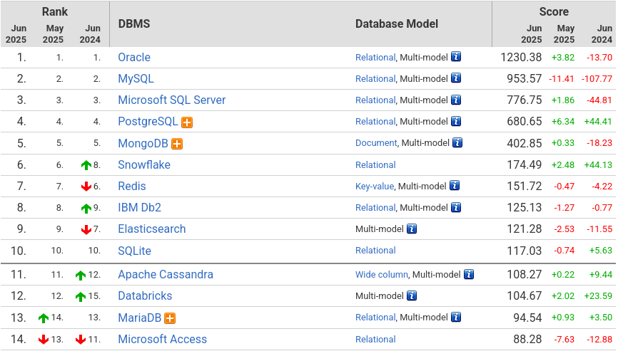

# 📊 Choix du SGDBR : Explication et Benchmark

Ce document présente le processus de sélection d'un SGBDR (Système de Gestion de Base de Données Relationnelle) pour le projet **Mentorat** destiné au discord de **Simplon**, en se basant sur un benchmark des différentes solutions disponibles.

## ❓ Pourquoi un SGBDR

Un **SGBDR** est un logiciel basé sur le modèle relationnel. Il stocke les données sous forme de tables, les manipule via un langage déclaratif (comme SQL) et en assure l’administration. Il garantit la cohérence et la sécurité des données et convient aux applications avec des données liées, comme les sites web.

## 📌 Critères de sélection d’un SGBDR

### ⚡ Performance

- **Temps de réponse** : Rapidité d’exécution des requêtes, surtout pour les opérations complexes telles que les jointures.
- **Débit transactionnel** : Capacité à gérer un grand nombre de transactions par seconde.
- **Gestion de la concurrence** : Efficacité du système à gérer plusieurs opérations simultanées sans conflits.

### 📈 Scalabilité

La scalabilité d’un SGBDR détermine sa capacité à s’adapter à l’augmentation du volume de données et du nombre d’utilisateurs. Elle peut être :

- **Verticale** : Augmentation des ressources (CPU, mémoire).
- **Horizontale** : Répartition de la charge sur plusieurs serveurs.

### 🔐 Sécurité et contrôle d’accès

**Contrôle d’accès** : Gestion fine des permissions pour les utilisateurs et les rôles.

- **Chiffrement des données** : Protection des données sensibles.
- **Audit et traçabilité** : Capacité à enregistrer les actions des utilisateurs.

### 🧩 Types de données et extensibilité

- **Support de types de données avancés** : JSON, XML etc.
- **Extensibilité** : Possibilité d’ajouter des fonctions personnalisées, des types de données définis par l’utilisateur.

## 📊 Benchmark des SGBDR

### Solutions comparées

| **SGBDR**      | **Description**                                                                                |
| -------------- | ---------------------------------------------------------------------------------------------- |
| **MySQL**      | Idéal pour des applications à fort trafic et des systèmes nécessitant une haute disponibilité. |
| **PostgreSQL** | Prisé pour sa conformité aux standards SQL et sa gestion des transactions complexes.           |
| **SQLite**     | Parfait pour les applications locales ou embarquées, offrant une installation sans serveur.    |

### Résultats de benchmarks (DB-engine)

 
Les statistiques montrent que PostgreSQL continue de progresser, renforçant sa position par rapport aux années précédentes. À l'inverse, MySQL connaît une baisse marquée depuis avril 2024, tandis que SQLite, bien qu’il reste dans le top 10, reste stable sans grandes variations. Cela met en évidence la solidité croissante de PostgreSQL comme choix optimal.

Dans un test simulant 10 000 requêtes concurrentes en lecture et écriture, voici les performances observées :

| **SGBDR**      | **Requêtes traitées par seconde (req/s)** |
| -------------- | ----------------------------------------- |
| **MySQL**      | 1300                                      |
| **PostgreSQL** | 1600                                      |
| **SQLite**     | 400                                       |

Les résultats montrent la solidité de **PostgreSQL** pour les systèmes nécessitant une gestion efficace des écritures complexes et des transactions simultanées. **MySQL**, quant à lui, se révèle plus performant dans des scénarios à forte intensité de lectures rapides et à faible latence. Enfin, **SQLite** reste une solution idéale pour des applications légères, mais il est moins adapté aux charges de travail intenses ou aux environnements avec un grand nombre d'utilisateurs simultanés.

## 🏆 Choix final

Au vu de ces critères et résultats, **PostgreSQL** s’impose comme le choix le plus adapté pour le projet Mentorat.

- **Excellente gestion des écritures et lectures complexes** : La gestion efficace des transactions et des requêtes complexes est un atout majeur pour des applications de grande envergure.
- **Richesse fonctionnelle** : PostgreSQL dispose de nombreuses fonctionnalités avancées, telles que le support natif de JSON, les types personnalisés, les fonctions et procédures stockées, ce qui en fait une solution robuste et adaptable à divers cas d’usage.
- **Conformité aux standards SQL** : Cela garantit une compatibilité et une portabilité accrues avec les systèmes externes.
- **Open Source, gratuit et largement adopté** : Cela garantit un coût total de possession réduit et une large communauté active pour le support et l'innovation continue.

## ✅ En résumé

- **PostgreSQL** gère efficacement les lectures/écritures complexes.
- Conforme aux standards **SQL**, il assure une bonne interopérabilité.
- **Gratuit**, **open source**, et soutenu par une large communauté.
- Offre une **extensibilité** avancée (JSON, types personnalisés, fonctions).

Il constitue donc un choix robuste et pérenne pour le projet **Mentorat**.
